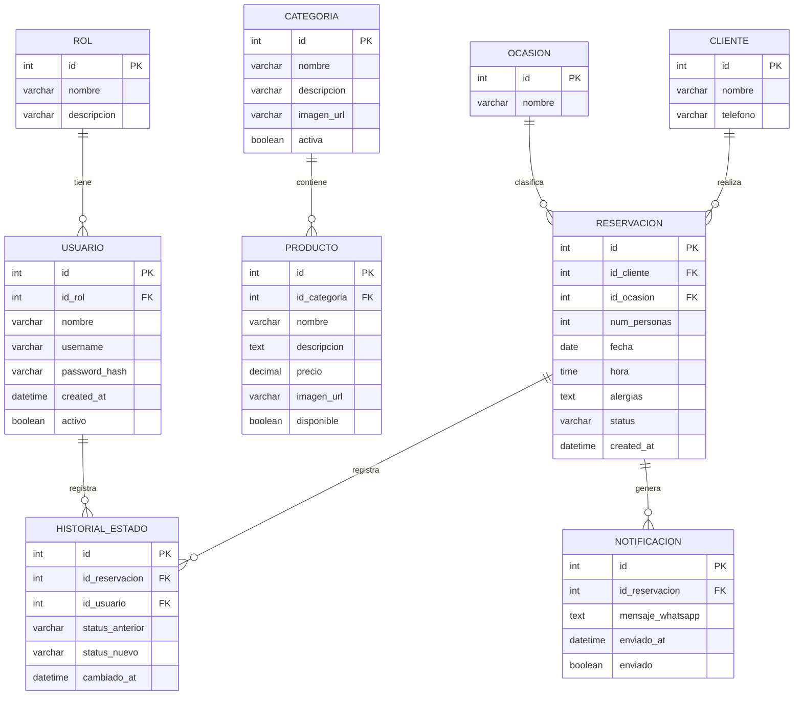

# Diseño de Base de Datos Relacional — Sistema Pan & Brunch

---

## Índice

- [Diseño de Base de Datos Relacional — Sistema Pan \& Brunch](#diseño-de-base-de-datos-relacional--sistema-pan--brunch)
  - [Índice](#índice)
  - [1. Objetivo del Sistema](#1-objetivo-del-sistema)
  - [2. Narrativa del Sistema](#2-narrativa-del-sistema)
  - [3. Identificacion de Entidades y Atributos](#3-identificacion-de-entidades-y-atributos)
  - [4. Relaciones entre Entidades](#4-relaciones-entre-entidades)
  - [5. Normalización aplicada](#5-normalización-aplicada)
    - [5.1 Primera Forma Normal (1NF)](#51-primera-forma-normal-1nf)
    - [5.2 Segunda Forma Normal (2NF)](#52-segunda-forma-normal-2nf)
    - [5.3 Tercera Forma Normal (3NF) / BCNF](#53-tercera-forma-normal-3nf--bcnf)
  - [6. Modelo Entidad-Relación (Diagrama](#6-modelo-entidad-relación-diagrama)
  - [7. Sentencias SQL — Creación de la Base de Datos](#7-sentencias-sql--creación-de-la-base-de-datos)

---

## 1. Objetivo del Sistema

Desarrollar una base de datos relacional que soporte el sistema de gestión de una pastelería y brunch llamada **Pan & Brunch**, permitiendo administrar reservaciones de clientes, el catálogo de productos del menú, las categorías del menú, el control de ocasiones especiales, el registro de usuarios administradores del sistema, y el historial de notificaciones generadas hacia el cliente vía WhatsApp.

El sistema deberá cumplir con las reglas de integridad referencial, encontrarse normalizado hasta la **Tercera Forma Normal (3NF)** y ser implementable en **SQLite** como motor de base de datos ligero, dentro de una aplicación web con arquitectura cliente-servidor.

---

## 2. Narrativa del Sistema

**Pan & Brunch** es una pastelería y restaurante de brunch ubicada en Cd. Del Carmen, Campeche. La empresa desea contar con un sistema web que funcione como landing page pública y como panel de administración interno.

Del lado público, los clientes podrán consultar el menú del establecimiento, el cual está organizado por categorías (por ejemplo: pasteles, bebidas, desayunos, postres). Cada producto del menú pertenece a una categoría, tiene un nombre, descripción, precio y disponibilidad. Los clientes también podrán realizar una **reservacion**, para lo cual deben proporcionar su nombre, número telefónico, número de personas, fecha y hora deseada, una nota sobre alimentos a los que son alérgicos (campo opcional) y el tipo de ocasión que van a celebrar (cumpleaños, aniversario, festejo general etc.).

Cada reservación queda registrada en el sistema con un estado que puede ser: *pendiente*, *confirmada* o *cancelada*. Al completar el formulario, el sistema genera automáticamente un mensaje con formato que es enviado vía WhatsApp al número del negocio. El texto de ese mensaje, junto con la fecha y hora de envío, queda guardado en la base de datos como un **registro de notificación** vinculado a la reservación correspondiente.

Del lado administrativo, el sistema cuenta con usuarios internos que pueden iniciar sesión con credenciales. Estos usuarios tienen un rol asignado (administrador o staff). Los administradores pueden gestionar el menú (altas, bajas y modificaciones de productos y categorías), revisar y cambiar el estado de las reservaciones, y consultar el historial de notificaciones enviadas. Los usuarios de tipo staff únicamente pueden consultar reservaciones y cambiar su estado.

Para dar trazabilidad a los cambios de estado en las reservaciones, el sistema lleva un **historial de cambios de estado**, registrando quién realizó el cambio, cuándo y a qué estado se movió la reservación.

---

## 3. Identificacion de Entidades y Atributos

A partir de la narrativa se identifican los siguirntes sustantivos relevantes y se depuran las entidades pertinentes al problema:

| Entidad             | Descripción                                                  |
|---------------------|--------------------------------------------------------------|
| `categoria`         | Clasifica los productos del menú                            |
| `producto`          | Ítem del menú con nombre, precio y disponibilidad           |
| `ocasion`           | Tipo de celebración para la reservación                     |
| `cliente`           | Persona que realiza una reservación                         |
| `reservacion`       | Solicitud de mesa con fecha, hora y detalles del cliente    |
| `notificacion`      | Mensaje WhatsApp generado a partir de una reservación       |
| `rol`               | Tipo de acceso de un usuario del sistema                    |
| `usuario`           | Administrador o staff que opera el sistema                  |
| `historial_estado`  | Registro de cambios de estado en una reservación            |

**Total: 9 tablas** — dentro del rango solicitado (6 a 10).

---

## 4. Relaciones entre Entidades

| Relación                              | Cardinalidad | Resolución                                              |
|---------------------------------------|--------------|----------------------------------------------------------|
| `categoria` → `producto`             | 1:N          | FK `id_categoria` en tabla `producto`                   |
| `ocasion` → `reservacion`            | 1:N          | FK `id_ocasion` en tabla `reservacion`                  |
| `cliente` → `reservacion`            | 1:N          | FK `id_cliente` en tabla `reservacion`                  |
| `reservacion` → `notificacion`       | 1:N          | FK `id_reservacion` en tabla `notificacion`             |
| `reservacion` → `historial_estado`   | 1:N          | FK `id_reservacion` en tabla `historial_estado`         |
| `usuario` → `historial_estado`       | 1:N          | FK `id_usuario` en tabla `historial_estado`             |
| `rol` → `usuario`                    | 1:N          | FK `id_rol` en tabla `usuario`                          |

---

## 5. Normalización aplicada

### 5.1 Primera Forma Normal (1NF)
Todos los atributos de todas las tablas contienen valores **atómicos** (un solo valor por campo). Por ejemplo, el campo `alergias` en `reservacion` almacena un texto simple y no una lista de múltiples alérgenos en el mismo campo. Similarmente, `ocasion` es una entidad separada y no un campo con múltiples valores en `reservacion`.

### 5.2 Segunda Forma Normal (2NF)
Todas las tablas se encuentran en 1NF y cada atributo no llave depende **totalmente** de la llave primaria. Dado que todas las tablas utilizan llaves primarias simples (`id` autoincremental), no existen dependencias parciales posibles.

**Ejemplo aplicado:** En un diseño sin normalizar, `reservacion` podría haber contenido `nombre_ocasion` directamente. Esto se separó en la tabla `ocasion` para que `nombre_ocasion` dependa únicamente de `id_ocasion` y no de la llave de reservación.

### 5.3 Tercera Forma Normal (3NF) / BCNF
No existen **dependencias transitivas** en ninguna tabla. Cada atributo no llave depende directa y únicamente de la llave primaria.

**Ejemplo aplicado:** El campo `precio` del producto podría haber generado una dependencia transitiva si se almacenara dentro de `reservacion`. Al separar `producto` en su propia tabla, el precio depende solo de `id_producto`. Del mismo modo, `nombre_rol` depende únicamente de `id_rol` en la tabla `rol`, y no de `id_usuario` en `usuario`.

---

## 6. Modelo Entidad-Relación (Diagrama



---

## 7. Sentencias SQL — Creación de la Base de Datos

```sql
-- ============================================================
-- Base de datos: pan_brunch
-- Motor: SQLite
-- Descripción: Sistema de reservaciones y menú — Pan & Brunch
-- Autor: Emmanuel (210785)
-- ============================================================

PRAGMA foreign_keys = ON;

-- ------------------------------------------------------------
-- Tabla: rol
-- Descripción: Define los tipos de acceso de los usuarios
-- ------------------------------------------------------------
CREATE TABLE IF NOT EXISTS rol (
    id          INTEGER PRIMARY KEY AUTOINCREMENT,
    nombre      VARCHAR(50)  NOT NULL UNIQUE,
    descripcion VARCHAR(255)
);

INSERT INTO rol (nombre, descripcion) VALUES
    ('administrador', 'Acceso completo al sistema'),
    ('staff',         'Acceso de lectura y cambio de estado de reservaciones');


-- ------------------------------------------------------------
-- Tabla: usuario
-- Descripción: Usuarios internos del sistema (admin y staff)
-- ------------------------------------------------------------
CREATE TABLE IF NOT EXISTS usuario (
    id            INTEGER PRIMARY KEY AUTOINCREMENT,
    id_rol        INTEGER      NOT NULL,
    nombre        VARCHAR(100) NOT NULL,
    username      VARCHAR(50)  NOT NULL UNIQUE,
    password_hash VARCHAR(255) NOT NULL,
    activo        INTEGER      NOT NULL DEFAULT 1,
    created_at    DATETIME     NOT NULL DEFAULT (datetime('now')),
    FOREIGN KEY (id_rol) REFERENCES rol(id)
);


-- ------------------------------------------------------------
-- Tabla: categoria
-- Descripción: Categorías del menú (pasteles, bebidas, etc.)
-- ------------------------------------------------------------
CREATE TABLE IF NOT EXISTS categoria (
    id          INTEGER PRIMARY KEY AUTOINCREMENT,
    nombre      VARCHAR(100) NOT NULL UNIQUE,
    descripcion VARCHAR(255),
    imagen_url  VARCHAR(500),
    activa      INTEGER      NOT NULL DEFAULT 1
);


-- ------------------------------------------------------------
-- Tabla: producto
-- Descripción: Ítems del menú con precio y disponibilidad
-- ------------------------------------------------------------
CREATE TABLE IF NOT EXISTS producto (
    id           INTEGER PRIMARY KEY AUTOINCREMENT,
    id_categoria INTEGER      NOT NULL,
    nombre       VARCHAR(150) NOT NULL,
    descripcion  TEXT,
    precio       DECIMAL(8,2) NOT NULL,
    imagen_url   VARCHAR(500),
    disponible   INTEGER      NOT NULL DEFAULT 1,
    FOREIGN KEY (id_categoria) REFERENCES categoria(id)
);


-- ------------------------------------------------------------
-- Tabla: ocasion
-- Descripción: Tipo de celebración de la reservación
-- ------------------------------------------------------------
CREATE TABLE IF NOT EXISTS ocasion (
    id     INTEGER PRIMARY KEY AUTOINCREMENT,
    nombre VARCHAR(100) NOT NULL UNIQUE
);

INSERT INTO ocasion (nombre) VALUES
    ('Cumpleaños'),
    ('Aniversario'),
    ('Festejo general'),
    ('Reunión de trabajo'),
    ('Graduación'),
    ('Otro');


-- ------------------------------------------------------------
-- Tabla: cliente
-- Descripción: Datos del cliente que hace la reservación
--              Separado de reservacion para cumplir 3NF:
--              nombre y telefono dependen del cliente,
--              no de la reservación.
-- ------------------------------------------------------------
CREATE TABLE IF NOT EXISTS cliente (
    id       INTEGER PRIMARY KEY AUTOINCREMENT,
    nombre   VARCHAR(150) NOT NULL,
    telefono VARCHAR(15)  NOT NULL
);


-- ------------------------------------------------------------
-- Tabla: reservacion
-- Descripción: Solicitud de reserva con fecha, hora y detalles
-- Status posibles: 'pendiente', 'confirmada', 'cancelada'
-- ------------------------------------------------------------
CREATE TABLE IF NOT EXISTS reservacion (
    id           INTEGER PRIMARY KEY AUTOINCREMENT,
    id_cliente   INTEGER     NOT NULL,
    id_ocasion   INTEGER     NOT NULL,
    num_personas INTEGER     NOT NULL,
    fecha        DATE        NOT NULL,
    hora         TIME        NOT NULL,
    alergias     TEXT,
    status       VARCHAR(20) NOT NULL DEFAULT 'pendiente',
    created_at   DATETIME    NOT NULL DEFAULT (datetime('now')),
    FOREIGN KEY (id_cliente) REFERENCES cliente(id),
    FOREIGN KEY (id_ocasion) REFERENCES ocasion(id),
    CHECK (status IN ('pendiente', 'confirmada', 'cancelada')),
    CHECK (num_personas >= 1)
);


-- ------------------------------------------------------------
-- Tabla: notificacion
-- Descripción: Registro del mensaje WhatsApp generado
--              por cada reservación
-- ------------------------------------------------------------
CREATE TABLE IF NOT EXISTS notificacion (
    id               INTEGER PRIMARY KEY AUTOINCREMENT,
    id_reservacion   INTEGER  NOT NULL,
    mensaje_whatsapp TEXT     NOT NULL,
    enviado_at       DATETIME NOT NULL DEFAULT (datetime('now')),
    enviado          INTEGER  NOT NULL DEFAULT 1,
    FOREIGN KEY (id_reservacion) REFERENCES reservacion(id)
);


-- ------------------------------------------------------------
-- Tabla: historial_estado
-- Descripción: Trazabilidad de cambios de estado en reservaciones.
--              Registra quién cambió, cuándo y de qué a qué estado.
-- ------------------------------------------------------------
CREATE TABLE IF NOT EXISTS historial_estado (
    id               INTEGER PRIMARY KEY AUTOINCREMENT,
    id_reservacion   INTEGER     NOT NULL,
    id_usuario       INTEGER     NOT NULL,
    status_anterior  VARCHAR(20) NOT NULL,
    status_nuevo     VARCHAR(20) NOT NULL,
    cambiado_at      DATETIME    NOT NULL DEFAULT (datetime('now')),
    FOREIGN KEY (id_reservacion) REFERENCES reservacion(id),
    FOREIGN KEY (id_usuario)     REFERENCES usuario(id)
);


-- ============================================================
-- Consultas de ejemplo
-- ============================================================

-- Reservaciones pendientes con nombre del cliente y ocasión
SELECT
    r.id,
    c.nombre       AS cliente,
    c.telefono,
    o.nombre       AS ocasion,
    r.num_personas,
    r.fecha,
    r.hora,
    r.alergias,
    r.status
FROM reservacion r
INNER JOIN cliente c ON r.id_cliente = c.id
INNER JOIN ocasion o ON r.id_ocasion = o.id
WHERE r.status = 'pendiente'
ORDER BY r.fecha ASC, r.hora ASC;


-- Productos disponibles con nombre de categoría
SELECT
    p.nombre       AS producto,
    p.descripcion,
    p.precio,
    c.nombre       AS categoria
FROM producto p
INNER JOIN categoria c ON p.id_categoria = c.id
WHERE p.disponible = 1 AND c.activa = 1
ORDER BY c.nombre, p.nombre;


-- Historial de cambios de estado con nombre de usuario
SELECT
    h.cambiado_at,
    u.nombre        AS usuario,
    h.status_anterior,
    h.status_nuevo,
    c.nombre        AS cliente,
    r.fecha,
    r.hora
FROM historial_estado h
INNER JOIN usuario     u ON h.id_usuario     = u.id
INNER JOIN reservacion r ON h.id_reservacion = r.id
INNER JOIN cliente     c ON r.id_cliente     = c.id
ORDER BY h.cambiado_at DESC;
```

---

*Entregable generado para la materia: Bases de Datos II*
*Matrícula: 210785*