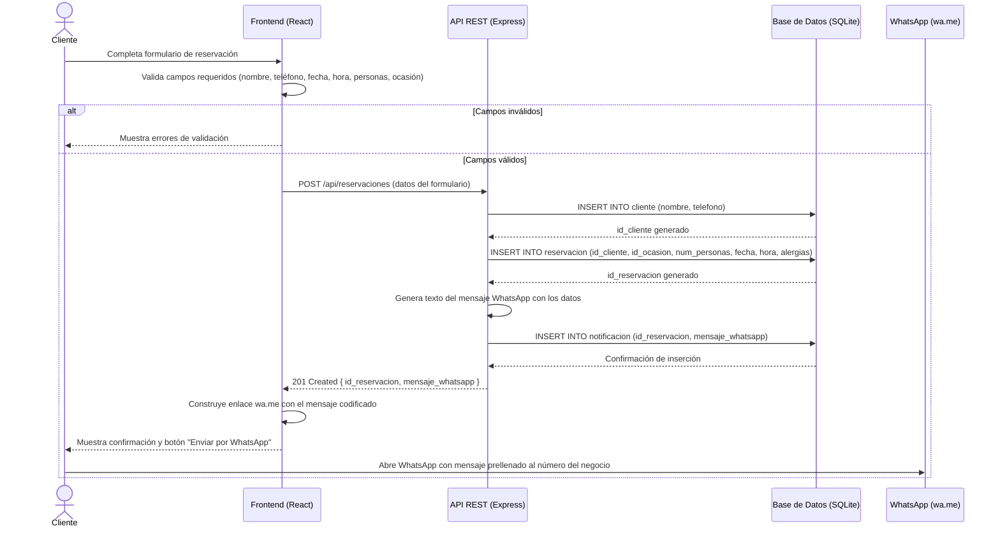
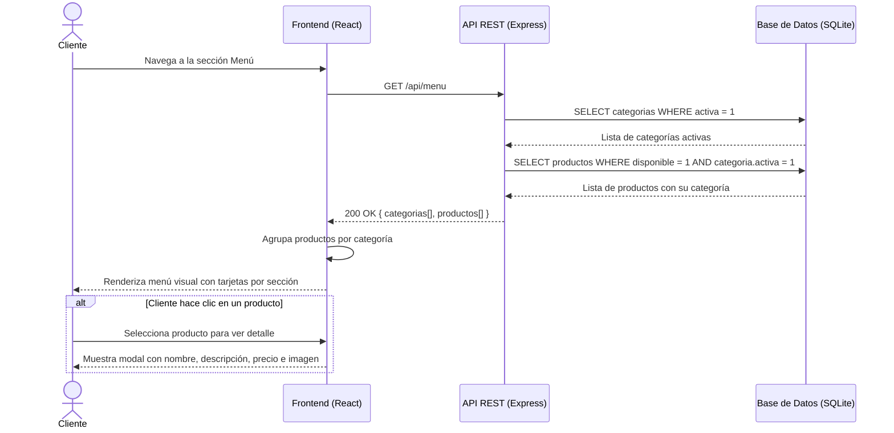
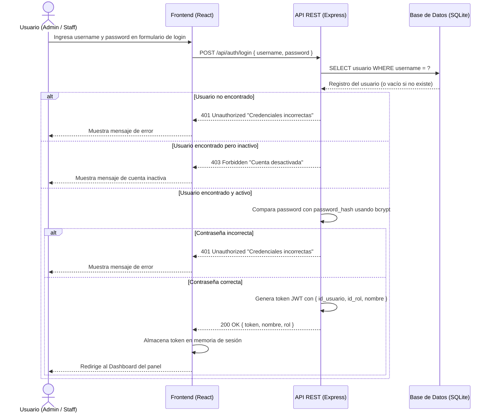
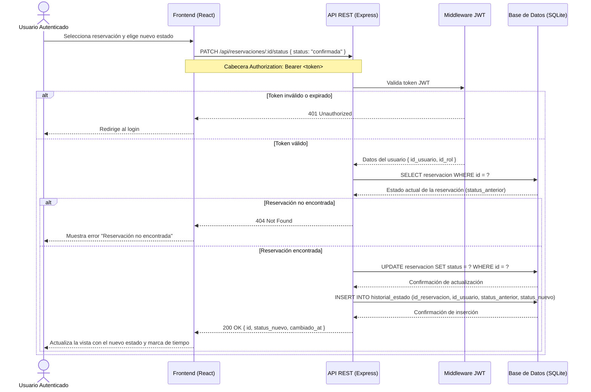
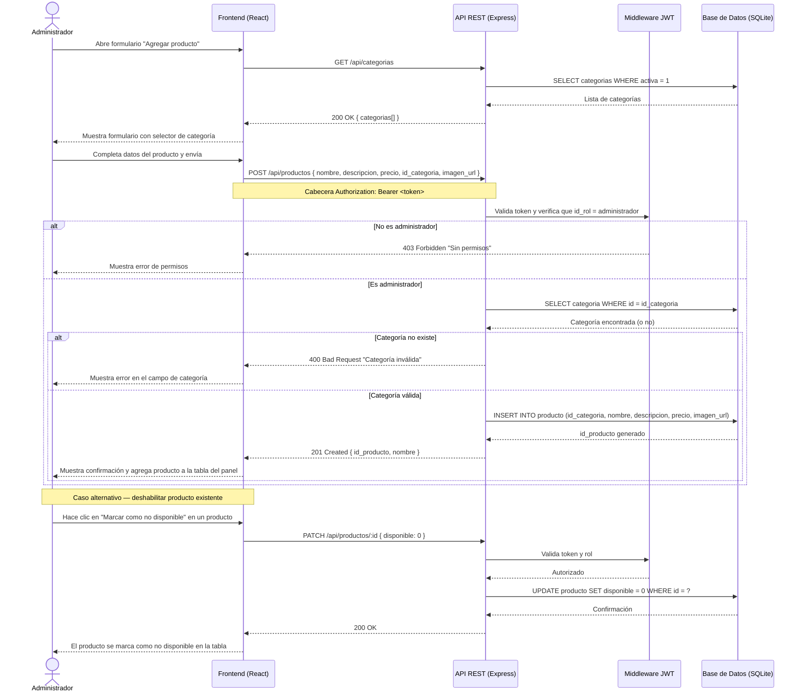

# Narrativa del Sistema — Pan & Brunch
## Gestión de Reservaciones y Menú Digital

---

## Índice

- [Narrativa del Sistema — Pan \& Brunch](#narrativa-del-sistema--pan--brunch)
  - [Gestión de Reservaciones y Menú Digital](#gestión-de-reservaciones-y-menú-digital)
  - [Índice](#índice)
  - [1. Descripción General del Sistema](#1-descripción-general-del-sistema)
  - [2. Descripción de Entidades y Datos del Sistema](#2-descripción-de-entidades-y-datos-del-sistema)
    - [2.1 `rol`](#21-rol)
    - [2.2 `usuario`](#22-usuario)
    - [2.3 `categoria`](#23-categoria)
    - [2.4 `producto`](#24-producto)
    - [2.5 `ocasion`](#25-ocasion)
    - [2.6 `cliente`](#26-cliente)
    - [2.7 `Reservacion`](#27-reservacion)
    - [2.8 `notificacion`](#28-notificacion)
    - [2.9 `historial_estado`](#29-historial_estado)
  - [3. Casos de Uso — Diagramas de Secuencia](#3-casos-de-uso--diagramas-de-secuencia)
    - [CU-01 Realizar una reservación (cliente público)](#cu-01-realizar-una-reservación-cliente-público)
    - [CU-02 Consultar el menú (cliente público)](#cu-02-consultar-el-menú-cliente-público)
    - [CU-03 Iniciar sesion (usuario administrador)](#cu-03-iniciar-sesion-usuario-administrador)
    - [CU-04 Cambiar estado de una reservación (administrador)](#cu-04-cambiar-estado-de-una-reservación-administrador)
    - [CU-05 Gestionar productos del menú (administrador)](#cu-05-gestionar-productos-del-menú-administrador)

---

## 1. Descripción General del Sistema

**Pan & Brunch** es una pastelería y restaurante de brunch ubicada en Villahermosa, Tabasco. El negocio atiende a una clientela que frecuentemente celebra ocasiones especiales: cumpleaños, aniversarios, graduaciones y reuniones de trabajo. Para mejorar su operación, el establecimiento requiere un sistema web que cumpla dos propósitos simultáneos:

**Cara pública:** una landing page donde cualquier visitante pueda explorar el menú de la pastelería —organizado por categorías— y realizar una reservación mediante un formulario en línea. Al completar la reservación, el sistema genera automáticamente un mensaje de WhatsApp con los datos del cliente y los detalles de la solicitud, que es enviado directamente al número del negocio para su atención inmediata.

**Cara administrativa:** un panel de acceso restringido donde el personal del establecimiento puede gestionar el catálogo de productos y categorías del menú, revisar el listado de reservaciones recibidas, actualizar su estado (pendiente, confirmada o cancelada) y consultar el historial de cambios realizados sobre cada reservación.

El sistema almacena toda la información en una base de datos relacional SQLite, expone una API REST construida con Node.js y Express, y presenta su interfaz mediante una aplicación React servida como sitio estático. El conjunto constituye una arquitectura cliente-servidor clásica de tres capas: presentación, lógica de negocio y persistencia de datos.

---

## 2. Descripción de Entidades y Datos del Sistema

A continuación se describe cada entidad que participa en el sistema, sus atributos y el papel que desempeña dentro del problema de gestión de datos.

---

### 2.1 `rol`
Representa los tipos de acceso que puede tener un usuario interno del sistema. Existen dos roles definidos: **administrador**, con acceso completo a todas las funciones del panel, y **staff**, con acceso limitado a la consulta y actualización de estado de reservaciones. Esta entidad garantiza que las reglas de acceso estén centralizadas y no dependan de valores codificados directamente en los usuarios.

| Atributo    | Tipo         | Descripción                              |
|-------------|--------------|------------------------------------------|
| id          | INTEGER PK   | Identificador único del rol              |
| nombre      | VARCHAR(50)  | Nombre del rol (administrador, staff)    |
| descripcion | VARCHAR(255) | Descripción de los permisos del rol      |

---

### 2.2 `usuario`
Representa a las personas internas del negocio que operan el panel de administración. Cada usuario tiene credenciales de acceso (username y contraseña en formato hash) y está asociado a un rol. El sistema registra la fecha de creación de cada cuenta y si está activa o no, permitiendo desactivar accesos sin eliminar el historial que ese usuario generó.

| Atributo      | Tipo          | Descripción                                 |
|---------------|---------------|---------------------------------------------|
| id            | INTEGER PK    | Identificador único del usuario             |
| id_rol        | INTEGER FK    | Rol asignado (referencia a `rol`)           |
| nombre        | VARCHAR(100)  | Nombre completo del usuario                 |
| username      | VARCHAR(50)   | Nombre de usuario para iniciar sesión       |
| password_hash | VARCHAR(255)  | Contraseña cifrada con bcrypt               |
| activo        | INTEGER       | 1 = activo, 0 = desactivado                 |
| created_at    | DATETIME      | Fecha y hora de creación del registro       |

---

### 2.3 `categoria`
Representa las divisiones del menú de la pastelería. Cada categoría agrupa productos relacionados, por ejemplo: *Pasteles*, *Bebidas*, *Desayunos*, *Postres*, *Panes artesanales*. Las categorías pueden activarse o desactivarse para ocultar secciones completas del menú sin necesidad de eliminar sus productos.

| Atributo    | Tipo         | Descripción                               |
|-------------|--------------|-------------------------------------------|
| id          | INTEGER PK   | Identificador único de la categoría       |
| nombre      | VARCHAR(100) | Nombre visible de la categoría            |
| descripcion | VARCHAR(255) | Descripción breve de la categoría         |
| imagen_url  | VARCHAR(500) | URL de la imagen representativa           |
| activa      | INTEGER      | 1 = visible en el menú, 0 = oculta        |

---

### 2.4 `producto`
Representa cada ítem disponible en el menú del establecimiento. Cada producto pertenece a una categoría, tiene un precio, una descripción y puede marcarse como no disponible temporalmente (por ejemplo, cuando un producto se agota en el día). Esta entidad es la base del catálogo público que los clientes consultan en la landing page.

| Atributo      | Tipo          | Descripción                                     |
|---------------|---------------|-------------------------------------------------|
| id            | INTEGER PK    | Identificador único del producto                |
| id_categoria  | INTEGER FK    | Categoría a la que pertenece                    |
| nombre        | VARCHAR(150)  | Nombre del producto                             |
| descripcion   | TEXT          | Descripción detallada del producto              |
| precio        | DECIMAL(8,2)  | Precio en pesos mexicanos                       |
| imagen_url    | VARCHAR(500)  | URL de la imagen del producto                   |
| disponible    | INTEGER       | 1 = disponible para pedido, 0 = no disponible   |

---

### 2.5 `ocasion`
Representa el tipo de celebración o motivo de la visita que el cliente declara al hacer su reservación. Tener esta información como entidad separada (y no como texto libre) permite al negocio filtrar y clasificar reservaciones por tipo de evento, facilitando la preparación anticipada de decoraciones o paquetes especiales. Los valores predefinidos incluyen: *Cumpleaños, Aniversario, Graduación, Reunión de trabajo, Festejo general, Otro*.

| Atributo | Tipo         | Descripción                            |
|----------|--------------|----------------------------------------|
| id       | INTEGER PK   | Identificador único de la ocasión      |
| nombre   | VARCHAR(100) | Nombre descriptivo de la ocasión       |

---

### 2.6 `cliente`
Representa a la persona del público general que realiza una reservación. Se almacenan únicamente los datos de contacto mínimos necesarios: nombre completo y número telefónico. Esta entidad está separada de `reservacion` para cumplir con la Tercera Forma Normal: los datos del cliente (nombre, teléfono) dependen del cliente, no de la reservación en sí. Un mismo cliente podría generar múltiples reservaciones en el tiempo.

| Atributo | Tipo         | Descripción                              |
|----------|--------------|------------------------------------------|
| id       | INTEGER PK   | Identificador único del cliente          |
| nombre   | VARCHAR(150) | Nombre completo del cliente              |
| telefono | VARCHAR(15)  | Número telefónico de contacto            |

---

### 2.7 `Reservacion`
Es la entidad central del sistema. Representa la solicitud formal de una mesa o espacio para una fecha y hora determinadas. Vincula al cliente con su ocasión de visita y registra el número de personas, cualquier restricción alimentaria relevante (campo de texto libre) y el estado actual de la solicitud. El estado sigue el ciclo: *pendiente → confirmada* o *pendiente → cancelada*.

| Atributo      | Tipo         | Descripción                                          |
|---------------|--------------|------------------------------------------------------|
| id            | INTEGER PK   | Identificador único de la reservación                |
| id_cliente    | INTEGER FK   | Cliente que realiza la reservación                   |
| id_ocasion    | INTEGER FK   | Tipo de ocasión de la visita                         |
| num_personas  | INTEGER      | Número de personas que asistirán                     |
| fecha         | DATE         | Fecha solicitada para la reservación                 |
| hora          | TIME         | Hora solicitada para la reservación                  |
| alergias      | TEXT         | Notas sobre alimentos alérgicos (opcional)           |
| status        | VARCHAR(20)  | Estado: pendiente / confirmada / cancelada           |
| created_at    | DATETIME     | Fecha y hora en que se registró la reservación       |

---

### 2.8 `notificacion`
Registra el mensaje de WhatsApp generado automáticamente al crear una reservación. Almacena el texto completo del mensaje formateado, la fecha y hora en que fue generado, y una bandera que indica si el enlace fue activoado por el usuario. Esta entidad provee trazabilidad sobre cada comunicación enviada al negocio y permite al administrador verificar qué mensajes han sido generados.

| Atributo          | Tipo        | Descripción                                           |
|-------------------|-------------|-------------------------------------------------------|
| id                | INTEGER PK  | Identificador único de la notificación                |
| id_reservacion    | INTEGER FK  | Reservación que originó este mensaje                  |
| mensaje_whatsapp  | TEXT        | Texto completo del mensaje enviado vía wa.me          |
| enviado_at        | DATETIME    | Fecha y hora en que se generó el enlace               |
| enviado           | INTEGER     | 1 = enlace generado y activado, 0 = solo generado     |

---

### 2.9 `historial_estado`
Registra cada cambio de estado que sufre una reservacion, identificando qué usuario del sistema realizó el cambio, desde qué estado venía y hacia qué estado se movió. Esta entidad garantiza **trazabilidad y auditoría** completa sobre el ciclo de vida de cada reservación, permitiendo conocer la secuencia de decisiones tomadas sobre ella.

| Atributo        | Tipo         | Descripción                                          |
|-----------------|--------------|------------------------------------------------------|
| id              | INTEGER PK   | Identificador único del registro de cambio           |
| id_reservacion  | INTEGER FK   | Reservación que fue modificada                       |
| id_usuario      | INTEGER FK   | Usuario que realizó el cambio                        |
| status_anterior | VARCHAR(20)  | Estado previo al cambio                              |
| status_nuevo    | VARCHAR(20)  | Estado nuevo después del cambio                      |
| cambiado_at     | DATETIME     | Fecha y hora exacta del cambio                       |

---

## 3. Casos de Uso — Diagramas de Secuencia

---

### CU-01 Realizar una reservación (cliente público)

**Descripcion:** Un visitante de la landing page llena el formulario de reservación. El sistema valida los datos, registra al cliente y la reservación en la base de datos, genera el mensaje de WhatsApp formateado, lo guarda como notificación y redirige al cliente al enlace `wa.me` para completar el envío.

---

### CU-02 Consultar el menú (cliente público)

**Descripción:** Un visitante accede a la sección de menú de la landing page. El frontend solicita las categorías activas y sus productos disponibles al API. La información se muestra organizada visualmente por sección.

---

### CU-03 Iniciar sesion (usuario administrador)

**Descripcion:** Un usuario interno accede al panel de administración ingresando su username y contraseña. El API valida las credenciales, verifica que la cuenta esté activa, genera un token JWT y lo devuelve al frontend para autenticar las siguientes peticiones.

---

### CU-04 Cambiar estado de una reservación (administrador)

**Descripción:** Desde el panel de administración, un usuario autenticado revisa las reservaciones y actualiza el estado de una de ellas (por ejemplo, de *pendiente* a *confirmada*). El sistema actualiza el registro, guarda el cambio en el historial de auditoría e informa al usuario del resultado.

---

### CU-05 Gestionar productos del menú (administrador)

**Descripción:** Un administrador accede al módulo de gestión de menú para agregar un nuevo producto, asignándolo a una categoría existente. El sistema valida que la categoría exista, inserta el producto y confirma la operación. El caso incluye también la posibilidad de marcar un producto como no disponible sin eliminarlo.

---

*Entregable: Narrativa y Diagramas de Secuencia — Sistema Pan & Brunch*
*Matrícula: 210785*